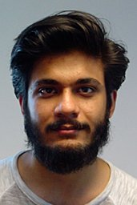

## About Me

Hi! I'm Zaid Qureshi and I stack transistors. I'm a sexy boi.

## Research Interest

I'm a sexy boi stacking transistors. I also mess with gpus sometimes. I'm a badass.

## Publications

1. [**Flatflash: Exploiting the byte-accessibility of ssds within a unified memory-storage hierarchy**](https://scholar.google.com/citations?view_op=view_citation&hl=en&user=geBhu-IAAAAJ&citation_for_view=geBhu-IAAAAJ:u-x6o8ySG0sC)  
A Abulila, VS Mailthody, Z Qureshi, J Huang, NS Kim, J Xiong, W Hwu  
*32 citations*, *2019*

2. [**Flatflash: Exploiting the byte-accessibility of ssds within a unified memory-storage hierarchy**](https://scholar.google.com/citations?view_op=view_citation&hl=en&user=geBhu-IAAAAJ&citation_for_view=geBhu-IAAAAJ:u-x6o8ySG0sC)  
A Abulila, VS Mailthody, Z Qureshi, J Huang, NS Kim, J Xiong, W Hwu  
*32 citations*, *2019*

3. [**Flatflash: Exploiting the byte-accessibility of ssds within a unified memory-storage hierarchy**](https://scholar.google.com/citations?view_op=view_citation&hl=en&user=geBhu-IAAAAJ&citation_for_view=geBhu-IAAAAJ:u-x6o8ySG0sC)  
A Abulila, VS Mailthody, Z Qureshi, J Huang, NS Kim, J Xiong, W Hwu  
*32 citations*, *2019*

## Typography

This is a [link](http://google.com). Something *italics* and something **bold**.

Title | Cited By | Year
-----|-------|--------
2014 | Emmy  | Won Outstanding Lead Actor in a miniseries or a movie
2015 | BAFTA | Nominated for Best Leading Actor for Sherlock
2014 | Satellite | Won Best Actor miniseries or television film

## References

* Foo Bar: Head of Department, Placeholder Names, Lorem
* John Doe: Associate Professor, Department of Computer Science, Ipsum
